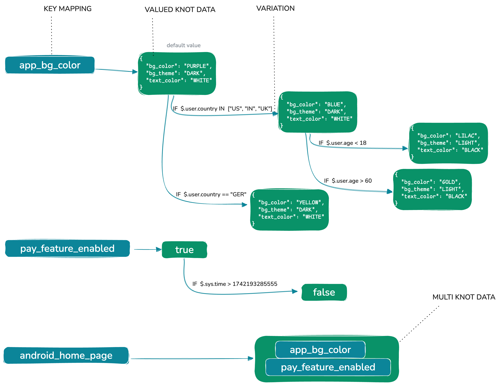
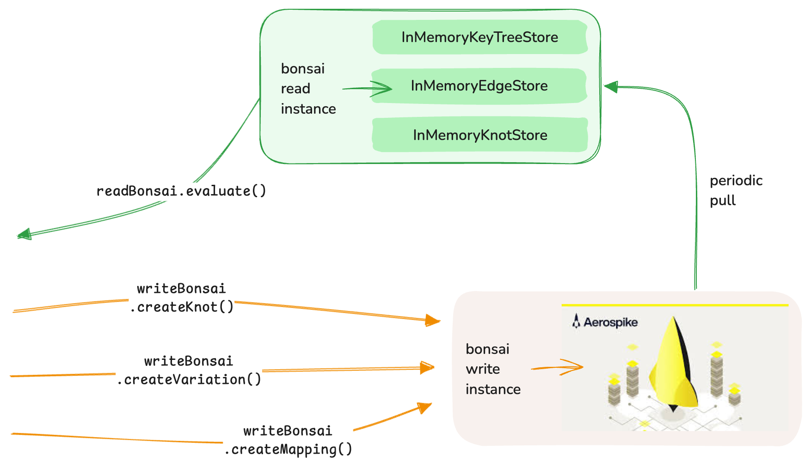

<p align="center">
  <h1 align="center">Bonsai</h1>
  <p align="center">Java Rule Engine library over a tree data-structure<p>
  <p align="center">
    <a href="https://github.com/PhonePe/bonsai/actions">
    	
    </a>
    <a href="https://s01.oss.sonatype.org/content/repositories/releases/com/phonepe/platform/bonsai/">
    	
    </a>
    <a href="https://github.com/PhonePe/bonsai/blob/master/LICENSE">
    	
    </a>
    <a href="https://javadoc.io/doc/com.phonepe.platform/bonsai">
    	
    </a>
  </p>
  <p align="center">
    <a href="https://sonarcloud.io/project/overview?id=PhonePe_bonsai">
    	
    </a>
    <a href="https://sonarcloud.io/project/overview?id=PhonePe_bonsai">
    	
    </a>
    <a href="https://sonarcloud.io/project/overview?id=PhonePe_bonsai">
    	
    </a>
    <a href="https://sonarcloud.io/project/overview?id=PhonePe_bonsai">
    	
    </a>
  </p>
</p>


Each one of us would have come across rule engines of different kinds in our respective software experiences. Rule engines are
typically structured as a set of rules that are evaluated against a **Context**. Bonsai is one such **data-structure**, that
allows you to represent the rule engine as a tree of knots and edges. The kicker here is that the tree can be
recursively nested, allowing you to represent really complex rules as simple nested forest of trees.

## Table of Contents

- [Overview](#overview)
- [Core Concepts](#core-concepts)
    - [Knot](#knot)
    - [Edge/Variation](#edgevariation)
    - [KnotData](#knotdata)
    - [Context](#context)
- [Operations](#operations)
    - [Knot Operations](#knot-operations)
    - [Edge Operations](#edge-operations)
    - [Tree Operations](#tree-operations)
- [Installation](#installation)
- [Storage](#storage)
- [Usage](#usage)
    - [Creating a Bonsai Instance](#creating-a-bonsai-instance)
    - [Building Trees](#building-trees)
    - [Evaluating Trees](#evaluating-trees)
    - [Delta Operations](#delta-operations)
- [Advanced Usage](#advanced-usage)
    - [Nested Tree Structures](#nested-tree-structures)
    - [Custom Context Implementation](#custom-context-implementation)
    - [Tree Validation](#tree-validation)
    - [Versioning and Concurrency](#versioning-and-concurrency)
    - [Contextual Preferences](#contextual-preferences)
- [Performance Considerations](#performance-considerations)
    - [Optimizing Tree Structure](#optimizing-tree-structure)
    - [Memory / Compute](#memory--compute)
- [Real-World Use Cases](#real-world-use-cases)
    - [Feature Flagging System](#feature-flagging-system)
    - [Dynamic Pricing Rules](#dynamic-pricing-rules)
- [Troubleshooting](#troubleshooting)
    - [Common Errors](#common-errors)
    - [Debugging Tips](#debugging-tips)

## Overview

Bonsai is a **Java Library** for data selection based on conditions. It is a powerful tree-based rule engine that enables you to:

1. Create a forest of trees with key-to-data mappings
2. Build complex decision trees with conditional branching
3. Represent nested, hierarchical rule structures
4. Evaluate rules against a context to traverse the tree and select the right data element. The Context and Rules are
   represented by a combination of [JsonPath](https://github.com/json-path/JsonPath) and [Query-DSL](https://github.com/PhonePe/query-dsl)
5. Modify trees dynamically with delta operations
6. Maintain versioning of tree components
7. Plug any storage implementations


## Motivation

While there are several rule engine options out there, none bridge the gap between data selection and rule definition in 
a nice way. They are either too heavy or are plain workflow systems being termed as rule engines.

Consider a scenario where data elements are configurations, and different variations of these configurations are to be
selected based on a set of conditions. What started off as a small rule engine for Frontend App configurations, Bonsai
as a library powers a large number of use-cases internally (A flavour of some of these are captured in
the [Real-World Use Cases](#real-world-use-cases) section. It is either used directly as a light-weight library, or
wrapped in a service that provides a UI to create and manage trees. One such prominent service is an internal feature 
flagging and configuration system, which powers the page structure, and launch / placement of most widgets on the PhonePe app.


## Core Concepts



### Knot

A Knot is the fundamental building block of the Bonsai tree structure:

- Each Knot has a unique identifier (`knotId`)
- Contains data (`KnotData`) which can be a value or references to other Knots
- Has an ordered list of Edges/Variations that define conditional paths to other Knots
- Maintains version information for tracking changes

Knots serve as decision points or data containers within the tree structure.

### Edge/Variation

Edges (also called Variations) connect Knots and define conditional paths through the tree:

- Each Edge has a unique identifier (`edgeId`)
- Points to a target Knot
- Contains a list of conditions/filters that determine when this path should be taken
- Edges are evaluated in priority order during tree traversal
- Maintains version information

Edges enable conditional branching based on the evaluation context.

### KnotData

KnotData represents the content stored within a Knot and comes in three types:

1. **ValuedKnotData**: Contains a primitive value
    - String
    - Boolean
    - Number
    - Bytes
    - JSON

2. **MultiKnotData**: Contains a list of keys that reference other Knots
    - Enables one-to-many relationships
    - Allows for list-based structures

3. **MapKnotData**: Contains a map of string keys to other Knot references
    - Enables key-based lookups
    - Allows for structured, nested data

### Context

Context is the evaluation entity against which the tree is traversed:

- Contains the data needed to evaluate conditions on Edges
- Passed during tree evaluation to determine which paths to follow
- Can be customized for specific application needs by extending the base Context class

At its core, lies a [jsonpath DocumentContext](https://github.com/json-path/JsonPath) 
```java
JsonPath.parse(object);
```

## Operations

Bonsai provides comprehensive operations for managing and traversing the tree structure.

### Knot Operations

```java
// Check if a Knot exists
boolean exists = bonsai.containsKnot("knotId");

// Create a Knot with data
Knot knot = bonsai.createKnot(knotData, properties);

// Get a Knot by ID
Knot knot = bonsai.getKnot("knotId");

// Update a Knot's data
Knot oldKnot = bonsai.updateKnotData("knotId", newKnotData, properties);

// Delete a Knot (with optional recursive deletion)
TreeKnot deletedTree = bonsai.deleteKnot("knotId", true);
```

### Edge Operations

```java
// Check if an Edge exists
boolean exists = bonsai.containsEdge("edgeId");

// Create an Edge directly
Edge edge = bonsai.createEdge(edgeObject);

// Add a Variation to a Knot
Edge edge = bonsai.addVariation("knotId", variation);

// Update a Variation
Edge updatedEdge = bonsai.updateVariation("knotId", "edgeId", newVariation);

// Unlink a Variation (remove the Edge but keep the Knot)
bonsai.unlinkVariation("knotId", "edgeId");

// Delete a Variation (with optional recursive deletion)
TreeEdge deletedEdge = bonsai.deleteVariation("knotId", "edgeId", true);

// Get an Edge by ID
Edge edge = bonsai.getEdge("edgeId");

// Get multiple Edges by IDs
Map<String, Edge> edges = bonsai.getAllEdges(edgeIds);
```

### Tree Operations

```java
// Check if a key mapping exists
boolean exists = bonsai.containsKey("key");

// Create a mapping between a key and an existing Knot
Knot knot = bonsai.createMapping("key", "knotId");

// Create a new Knot and map it to a key
Knot knot = bonsai.createMapping("key", knotData, properties);

// Get the Knot ID for a key
String knotId = bonsai.getMapping("key");

// Remove a key mapping
Knot unmappedKnot = bonsai.removeMapping("key");

// Get the complete tree for a key
TreeKnot tree = bonsai.getCompleteTree("key");

// Create a complete tree from a TreeKnot structure
Knot rootKnot = bonsai.createCompleteTree(treeKnot);

// Evaluate a key against a context
KeyNode result = bonsai.evaluate("key", context);

// Get a flat representation of the evaluated tree
FlatTreeRepresentation flatTree = bonsai.evaluateFlat("key", context);
```

## Installation

Add the Bonsai dependency to your Maven project:

```xml
<dependency>
    <groupId>com.phonepe.commons</groupId>
    <artifactId>bonsai-core</artifactId>
    <version>${bonsai.version}</version>
</dependency>
```

For Gradle:

```groovy
implementation 'com.phonepe.commons:bonsai-core:${bonsai.version}'
```

## Storage

Out of the box, there are no persistent storage implementations provided, with reason. This is with a view to keep the
library as light and extensible as possible. The default implementation uses an in-memory storage, but you can provide
custom implementations for persistent storage.

The efficient way to go about implementing a storage is to keep the read and write instances separate.

A single instance of the In-memory storage implementation is threadsafe and should be the default choice for all read
workloads in your application. Depending on the amount of keys you plan on creating, it is advisable to use a NOSQL
key value store like Redis, Aerospike, or Cassandra can be supplied as the storage implementation for persistent
storage. Having said that, a relational setup would work equally well. 

The image below shows a good way to model storage when using it in production.



## Usage

### Creating a Bonsai Instance

```java
// Create a Bonsai instance using the builder
Bonsai<MyContext> bonsai = BonsaiBuilder.builder()
    .withBonsaiProperties(
            BonsaiProperties.builder()
                    .maxAllowedVariationsPerKnot(10)  // Limit variations per knot
                    .maxAllowedConditionsPerEdge(10)  // Limit conditions per variation
                    .mutualExclusivitySettingTurnedOn(false)
                    .build())
    .withBonsaiIdGenerator(new UUIDGenerator())    // ID generation strategy
    .withEdgeStore(new InMemoryEdgeStore())        // Edge storage implementation
    .withKeyTreeStore(new InMemoryKeyTreeStore())  // Key-Tree mapping storage
    .withKnotStore(new InMemoryKnotStore())        // Knot storage implementation
    .build();
```

### Building Trees

Below code is just a sample of custom creation is possible. Ideally, you would wrap these operations in your application,
with some UI layer to facilitate the creation. 

```java
// Create a simple decision tree for user eligibility
// First, create the leaf knots with values
Knot eligibleKnot = bonsai.createKnot(
    ValuedKnotData.builder().booleanValue(true).build(),
    Map.of("description", "User is eligible")
);

Knot ineligibleKnot = bonsai.createKnot(
    ValuedKnotData.builder().booleanValue(false).build(),
    Map.of("description", "User is ineligible")
);

// Create the root knot with no data
Knot rootKnot = bonsai.createKnot(
    ValuedKnotData.builder().build(),
    Map.of("description", "User could be eligible")
);

// Add variations to the root knot
bonsai.addVariation(rootKnot.getId(), Variation.builder()
    .knotId(eligibleKnot.getId())
    .filters(List.of(
        Filter.builder()
            .path("$.user.age")
            .operator(Operator.GREATER_THAN_EQUAL)
            .value(18)
            .build(),
        Filter.builder()
            .path("$.user.country")
            .operator(Operator.IN)
            .value(List.of("US", "CA", "UK"))
            .build()
    ))
    .build());

bonsai.addVariation(rootKnot.getId(), Variation.builder()
    .knotId(ineligibleKnot.getId())
    .filters(List.of(Filter.builder()
            .path("$.user.age")
            .operator(Operator.LESSER_THAN_EQUAL)
            .value(10)
            .build())) 
    .build());

// Map a key to the root knot
bonsai.createMapping("userEligibility", rootKnot.getId());
```

### Evaluating Trees

```java
// Create a context for evaluation
MyContext myContextObject = new MyContext("{\"user\": {\"age\": 25, \"country\": \"US\"}}");
Context context = Context.builder()
        .documentContext(Parsers.parse(myContextObject))
        .build();

// Evaluate the tree
KeyNode result = bonsai.evaluate("userEligibility", context);

// Access the evaluation result
Boolean isEligible = result.getValue().getBooleanValue();
System.out.println("User is eligible: " + isEligible); // true
```

### Delta Operations

Delta operations allow you to make batch changes to the tree structure. This is useful when you are trying to audit and 
control changes happening in your trees. 

```java
// Create a list of delta operations
List<DeltaOperation> operations = new ArrayList<>();

// Add an operation to create a new knot
operations.add(DeltaOperation.builder()
    .operationType(OperationType.CREATE_KNOT)
    .knotData(ValuedKnotData.builder().stringValue("New value").build())
    .properties(Map.of("description", "New knot"))
    .build());

// Add an operation to create a mapping
operations.add(DeltaOperation.builder()
    .operationType(OperationType.CREATE_MAPPING)
    .key("newKey")
    .knotId("generatedKnotId") // ID from the previous operation
    .build());

// Apply the delta operations
TreeKnotState result = bonsai.applyDeltaOperations("rootKey", operations);

// The result contains the updated tree and revert operations
TreeKnot updatedTree = result.getTreeKnot();
List<DeltaOperation> revertOperations = result.getRevertDeltaOperations();
```

## Advanced Usage

### Nested Tree Structures

Bonsai allows for complex nested tree structures using MapKnotData and MultiKnotData:

```java
// Create knots for different user tiers
Knot silverTierKnot = bonsai.createKnot(
    ValuedKnotData.builder().stringValue("Silver benefits").build(),
    Map.of()
);

Knot goldTierKnot = bonsai.createKnot(
    ValuedKnotData.builder().stringValue("Gold benefits").build(),
    Map.of()
);

Knot platinumTierKnot = bonsai.createKnot(
    ValuedKnotData.builder().stringValue("Platinum benefits").build(),
    Map.of()
);

// Create a map knot that references different tiers
Knot userTiersKnot = bonsai.createKnot(
    MapKnotData.builder()
        .keyMapping(Map.of(
            "silver", silverTierKnot.getId(),
            "gold", goldTierKnot.getId(),
            "platinum", platinumTierKnot.getId()
        ))
        .build(),
    Map.of("description", "User tier benefits")
);

// Map a key to the user tiers knot
bonsai.createMapping("userBenefits", userTiersKnot.getId());

// During evaluation, you can access nested structures
KeyNode result = bonsai.evaluate("userBenefits", context);
Map<String, KeyNode> tierMap = result.getKeyNodeMap();
KeyNode goldBenefits = tierMap.get("gold");
String benefits = goldBenefits.getValue().getStringValue(); // "Gold benefits"
```

### Custom Context Implementation

Create a custom Context implementation for your specific needs:

```java
public class UserContext extends Context {
    private User user;
    private Map<String, Object> additionalData;
    
    // Implement methods to access user data for condition evaluation
    public int getUserAge() {
        return user.getAge();
    }
    
    public String getUserCountry() {
        return user.getCountry();
    }
}
```

### Tree Validation

Validate tree structures before using them:

```java
// Create a validator
BonsaiTreeValidator validator = new ComponentBonsaiTreeValidator();

// Validate a tree structure
ValidationResult result = validator.validate(treeKnot);

if (!result.isValid()) {
    // Handle validation errors
    List<ValidationError> errors = result.getErrors();
    for (ValidationError error : errors) {
        System.err.println(error.getMessage());
    }
}
```

### Versioning and Concurrency

Bonsai supports versioning of tree components to handle concurrent modifications:

```java
// Get the current version of a knot
Knot knot = bonsai.getKnot("knotId");
long version = knot.getVersion();

// Update with version check
try {
    bonsai.updateKnotData("knotId", newKnotData, 
        Map.of("version", version, "description", "Updated knot"));
} catch (BonsaiError e) {
    if (e.getErrorCode() == BonsaiErrorCode.VERSION_MISMATCH) {
        // Handle concurrent modification
        System.err.println("Knot was modified by another process");
    }
}
```

### Contextual Preferences

`Context` allows you to set a `preferences` Map, which comes handy if you wanted to allow
This acts like a short circuit during evaluation. If the Knot is found in the preferences, the evaluation does NOT happen
from the rule engine, but the Knot gets returned directly. This is useful when you want to override the evaluation
results for a specific key.

Eg: say you had a bunch of rules to govern the background of your home page (under a key called `home_page`). But 
you wish to allow users to set their own home page settings

```java
// Get the current version of a knot
Knot knot = bonsai.getKnot("home_page");
Map<String, Knot> preferences = preferenceStore.get(userId); // this storage will have to be implemented by you
Context context = new Context(Parsers.parse(userData, preferences)); 
bonsai.evaluate("home_page", context);
```

## Performance Considerations

### Optimizing Tree Structure

For optimal performance with Bonsai trees:

1. **Limit Tree Depth**: Keep tree depth reasonable (< 10 levels) to avoid excessive traversal time
2. **Optimize Edge Conditions**: Use simple conditions when possible and limit the number of conditions per edge
3. **Balance Tree Structure**: Distribute decision points evenly to avoid heavily skewed trees
4. **Batch Operations**: Use delta operations for auditing changes to the tree
5. **Storage**: Refer the [Storage Section](#storage) for optimal storage strategies

### Memory / Compute

Bonsai trees can be memory-intensive for large structures. Consider:

1. Implementing some form of eviction policy for in-memory storage (when loading all data from your persistence layer)
2. The evaluation of the tree can be compute intensive for large objects. While this is battle tested in PhonePe for a
   large number of operations on fairly large context object, it is advisable to test the performance of your tree. 


## Real-World Use Cases

### Feature Flagging System

Bonsai can be used to implement a sophisticated feature flagging system:

```java
// Create feature flag knots
Knot enabledKnot = bonsai.createKnot(
    ValuedKnotData.builder().booleanValue(true).build(),
    Map.of()
);

Knot disabledKnot = bonsai.createKnot(
    ValuedKnotData.builder().booleanValue(false).build(),
    Map.of()
);

// Create a feature flag with conditions
Knot featureFlagKnot = bonsai.createKnot(
    ValuedKnotData.builder().build(),
    Map.of("description", "New UI Feature Flag")
);

// Enable for beta users and specific regions
bonsai.addVariation(featureFlagKnot.getId(), Variation.builder()
    .knotId(enabledKnot.getId())
    .filters(List.of(
        Filter.builder()
            .path("$.user.betaProgram")
            .operator(Operator.EQUALS)
            .value(true)
            .build(),
        Filter.builder()
            .path("$.user.region")
            .operator(Operator.IN)
            .value(List.of("US-WEST", "EU-CENTRAL"))
            .build()
    ))
    .build());

// Default to disabled
bonsai.addVariation(featureFlagKnot.getId(), Variation.builder()
    .knotId(disabledKnot.getId())
    .filters(List.of())
    .build());

// Map to a key
bonsai.createMapping("features.newUI", featureFlagKnot.getId());
```

### Dynamic Pricing Rules

Implement complex pricing rules with nested conditions:

```java
// Create pricing tiers
Knot standardPricing = bonsai.createKnot(
    ValuedKnotData.builder().numberValue(10.0).build(),
    Map.of("description", "Standard pricing")
);

Knot discountedPricing = bonsai.createKnot(
    ValuedKnotData.builder().numberValue(8.5).build(),
    Map.of("description", "Discounted pricing")
);

Knot premiumPricing = bonsai.createKnot(
    ValuedKnotData.builder().numberValue(12.0).build(),
    Map.of("description", "Premium pricing")
);

// Create pricing decision tree
Knot pricingRoot = bonsai.createKnot(
    ValuedKnotData.builder().build(),
    Map.of("description", "Pricing decision root")
);

// Premium pricing for high-demand times
bonsai.addVariation(pricingRoot.getId(), Variation.builder()
    .knotId(premiumPricing.getId())
    .filters(List.of(
        Filter.builder()
            .path("$.request.time")
            .operator(Operator.IN)
            .value(List.of("PEAK_MORNING", "PEAK_EVENING"))
            .build()
    ))
    .build());

// Discounted pricing for loyal customers
bonsai.addVariation(pricingRoot.getId(), Variation.builder()
    .knotId(discountedPricing.getId())
    .filters(List.of(
        Filter.builder()
            .path("$.user.loyaltyTier")
            .operator(Operator.GREATER_THAN_EQUAL)
            .value(3)
            .build()
    ))
    .build());

// Standard pricing as default
bonsai.addVariation(pricingRoot.getId(), Variation.builder()
    .knotId(standardPricing.getId())
    .filters(List.of())
    .build());

// Map to a key
bonsai.createMapping("pricing.standard", pricingRoot.getId());
```

## Troubleshooting

### Common Errors

| Error Code                                    | Description                                | Resolution                                                                    |
|-----------------------------------------------|--------------------------------------------|-------------------------------------------------------------------------------|
| CYCLE_DETECTED                                | A cycle was detected in the tree structure | Review your tree structure to ensure there are no circular references         |
| VARIATION_MUTUAL_EXCLUSIVITY_CONSTRAINT_ERROR | Edge variations violate mutual exclusivity | Ensure edge conditions don't overlap when mutual exclusivity is enabled       |
| TREE_ALREADY_EXIST                            | Tree creation through delta ops failure    | A tree for the said key mapping already exists, try with a new key            |
| MAX_VARIATIONS_EXCEEDED                       | Too many variations on a knot              | Increase the maxAllowedVariationsPerKnot property or restructure your tree    |
| MAX_CONDITIONS_EXCEEDED                       | Too many conditions on an edge             | Increase the maxAllowedConditionsPerEdge property or simplify your conditions |

### Debugging Tips

1. **Enable Logging**: Configure your logging framework to capture Bonsai debug/trace logs.
2. **Inspect Tree Structure**: Use `getCompleteTree()` to visualize the current tree structure
3. **Validate Before Use**: Use the validator to check tree integrity before evaluation
4. **Test Edge Cases**: Ensure your conditions handle edge cases correctly
5. **Check Context Data**: Verify that your context contains all required data for evaluation

## Contributing

Contributions to Bonsai are welcome! Here's how you can contribute:

1. Fork the repository
2. Create a feature branch (`git checkout -b feature/amazing-feature`)
3. Commit your changes (`git commit -m 'Add some amazing feature'`)
4. Push to the branch (`git push origin feature/amazing-feature`)
5. Open a Pull Request

Please ensure your code follows the project's coding standards and includes appropriate tests.

## License

Bonsai is licensed under the Apache License 2.0. See the [LICENSE](LICENSE) file for details.
