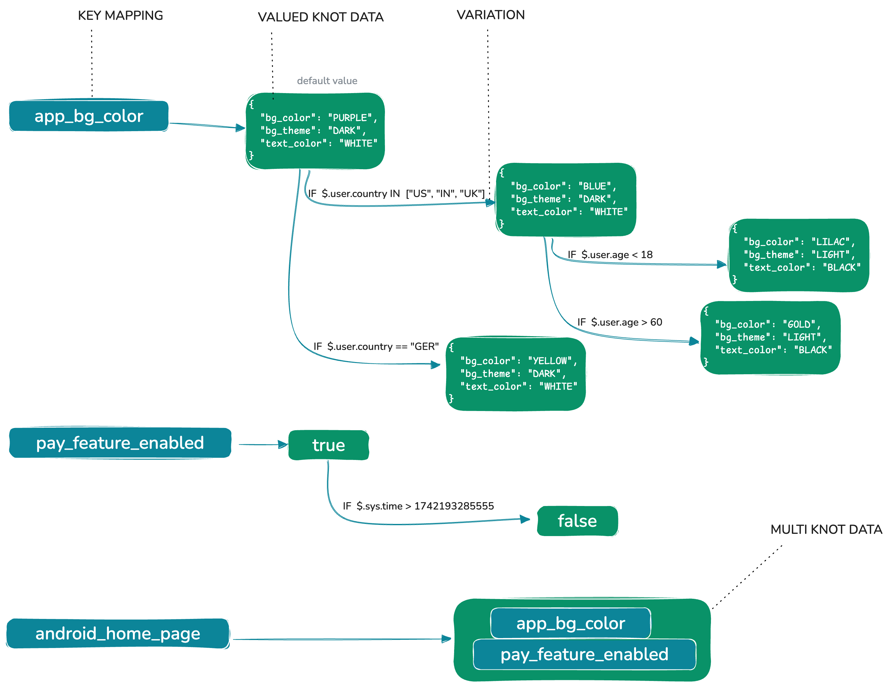

# Core Concepts

Understanding concepts that form the foundation of its tree-based rule engine is essential for effectively using Bonsai in your applications.

## Key Components



Bonsai's architecture revolves around four primary components:

1. [**Knot**](knot.md): The fundamental building block of the Bonsai tree structure
2. [**Edge/Variation**](edge.md): Connections between Knots that define conditional paths
3. [**KnotData**](knotdata.md): The content stored within a Knot
4. [**Context**](context.md): The evaluation entity against which the tree is traversed

These components work together to create a flexible and powerful rule engine that can represent complex decision logic in a structured and maintainable way.

## How It Works

At a high level, Bonsai operates as follows:

1. You create a forest of trees with key-to-data mappings
2. Each tree consists of Knots connected by Edges
3. Knots contain data or references to other Knots
4. Edges define conditions for traversing from one Knot to another
5. When evaluating a key, Bonsai traverses the tree based on the provided Context
6. The traversal follows the first Edge whose conditions match the Context
7. The result is the data from the final Knot reached during traversal

This structure allows for complex, nested rule definitions that can be evaluated efficiently against a given context.

## Example Scenario

Consider a simple example of a user eligibility check:

```
Root Knot
├── Edge: If user.age >= 18 AND user.country IN ["US", "CA", "UK"] → Eligible Knot
└── Edge: If user.age < 18 → Ineligible Knot
```

In this scenario:

- The Root Knot is the starting point
- Two Edges define the conditions for eligibility
- The Eligible and Ineligible Knots contain the result values (true/false)
- When evaluating with a Context (e.g., a user with age 25 from the US), Bonsai traverses the tree and returns the appropriate result (eligible: true)
