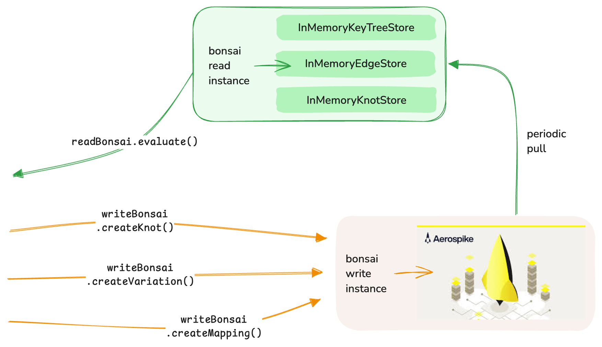

---
hide:
  - navigation
---

# Storage

Bonsai is designed with a flexible storage architecture that allows you to use different storage implementations for different environments and use cases. This page explains the storage options available and provides guidance on implementing custom storage solutions.

## Storage Architecture



Bonsai requires three storage components:

1. **KnotStore**: Responsible for storing and retrieving Knots
2. **EdgeStore**: Responsible for storing and retrieving Edges
3. **KeyTreeStore**: Responsible for storing and retrieving mappings between keys and root Knots

These components are defined as interfaces, allowing you to provide custom implementations for each.

## Default In-Memory Storage

Out of the box, Bonsai provides in-memory storage implementations:

- **InMemoryKnotStore**: Stores Knots in memory using a ConcurrentHashMap
- **InMemoryEdgeStore**: Stores Edges in memory using a ConcurrentHashMap
- **InMemoryKeyTreeStore**: Stores key-to-Knot mappings in memory using a ConcurrentHashMap

These implementations are suitable for development, testing, and small-scale applications, but they do not provide persistence across application restarts.

## Custom Storage Implementations

For production use, you'll likely want to implement custom storage backends that provide persistence. Here are some common approaches:

### Redis-Based Storage

Redis is a popular choice for Bonsai storage due to its performance and data structure support:

```java
public class RedisKnotStore implements KnotStore {
    private final RedisClient redisClient;
    private final ObjectMapper objectMapper;
    
    public RedisKnotStore(RedisClient redisClient) {
        this.redisClient = redisClient;
        this.objectMapper = new ObjectMapper();
    }
    
    @Override
    public Knot getKnot(String knotId) {
        String json = redisClient.get("knot:" + knotId);
        if (json == null) {
            return null;
        }
        try {
            return objectMapper.readValue(json, Knot.class);
        } catch (Exception e) {
            throw new RuntimeException("Failed to deserialize knot", e);
        }
    }
    
    @Override
    public void putKnot(Knot knot) {
        try {
            String json = objectMapper.writeValueAsString(knot);
            redisClient.set("knot:" + knot.getId(), json);
        } catch (Exception e) {
            throw new RuntimeException("Failed to serialize knot", e);
        }
    }
    
    // Implement other methods...
}
```

### Database-Based Storage

Relational or NoSQL databases can also be used for Bonsai storage:

```java
public class JdbcKnotStore implements KnotStore {
    private final DataSource dataSource;
    private final ObjectMapper objectMapper;
    
    public JdbcKnotStore(DataSource dataSource) {
        this.dataSource = dataSource;
        this.objectMapper = new ObjectMapper();
    }
    
    @Override
    public Knot getKnot(String knotId) {
        try (Connection conn = dataSource.getConnection();
             PreparedStatement stmt = conn.prepareStatement("SELECT data FROM knots WHERE id = ?")) {
            stmt.setString(1, knotId);
            try (ResultSet rs = stmt.executeQuery()) {
                if (rs.next()) {
                    String json = rs.getString("data");
                    return objectMapper.readValue(json, Knot.class);
                }
                return null;
            }
        } catch (Exception e) {
            throw new RuntimeException("Failed to retrieve knot", e);
        }
    }
    
    @Override
    public void putKnot(Knot knot) {
        try (Connection conn = dataSource.getConnection();
             PreparedStatement stmt = conn.prepareStatement(
                 "INSERT INTO knots (id, data) VALUES (?, ?) ON DUPLICATE KEY UPDATE data = ?")) {
            String json = objectMapper.writeValueAsString(knot);
            stmt.setString(1, knot.getId());
            stmt.setString(2, json);
            stmt.setString(3, json);
            stmt.executeUpdate();
        } catch (Exception e) {
            throw new RuntimeException("Failed to store knot", e);
        }
    }
    
    // Implement other methods...
}
```

## Separation of Read and Write Instances

For high-performance applications, it's recommended to separate read and write instances:

```java
// Read-only instance using in-memory storage
Bonsai<Context> readOnlyBonsai = BonsaiBuilder.builder()
    .withBonsaiProperties(BonsaiProperties.builder().build())
    .withEdgeStore(new InMemoryEdgeStore())
    .withKeyTreeStore(new InMemoryKeyTreeStore())
    .withKnotStore(new InMemoryKnotStore())
    .build();

// Write instance using persistent storage
Bonsai<Context> writeOnlyBonsai = BonsaiBuilder.builder()
    .withBonsaiProperties(BonsaiProperties.builder().build())
    .withEdgeStore(new RedisEdgeStore(redisClient))
    .withKeyTreeStore(new RedisKeyTreeStore(redisClient))
    .withKnotStore(new RedisKnotStore(redisClient))
    .build();
```

This approach allows you to optimize for read performance while ensuring data persistence.

## Caching Strategies

For improved performance, you can implement caching in your storage implementations:

```java
public class CachedKnotStore implements KnotStore {
    private final KnotStore delegate;
    private final Cache<String, Knot> cache;
    
    public CachedKnotStore(KnotStore delegate, Cache<String, Knot> cache) {
        this.delegate = delegate;
        this.cache = cache;
    }
    
    @Override
    public Knot getKnot(String knotId) {
        Knot knot = cache.get(knotId);
        if (knot == null) {
            knot = delegate.getKnot(knotId);
            if (knot != null) {
                cache.put(knotId, knot);
            }
        }
        return knot;
    }
    
    @Override
    public void putKnot(Knot knot) {
        delegate.putKnot(knot);
        cache.put(knot.getId(), knot);
    }
    
    // Implement other methods...
}
```

## Best Practices

- **Choose the right storage for your needs**: Consider factors like persistence, performance, and scalability
- **Implement proper error handling**: Storage operations should handle errors gracefully
- **Consider caching**: Use caching to improve performance for frequently accessed data
- **Ensure thread safety**: Storage implementations should be thread-safe
- **Optimize for read performance**: Most applications will have more reads than writes
- **Consider versioning**: Implement versioning to handle concurrent modifications
- **Test thoroughly**: Ensure your storage implementations work correctly under load
